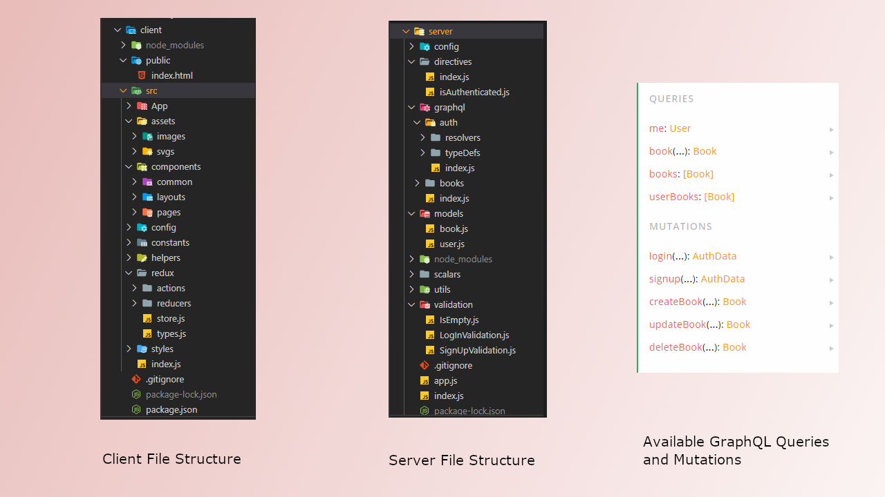
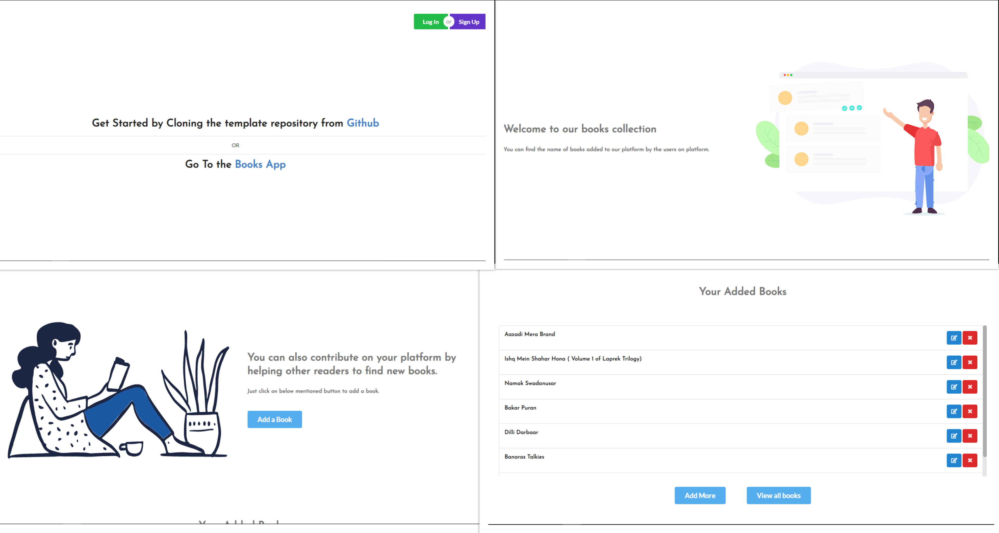

# MERN-GraphQL-Boilerplate
MERN-GraphQL Boilerplate which you can use for production level applications.

Feel free to contribute to repo by forking and sending pull requests.

For running the project on local machine

1. For server :-
  ```
  a. cd server
  b. npm install
  c. npm start
  ```
  Make sure your mongod command is running.
  
2. For client :-
  ```
  a. cd client
  b. npm install
  c. npm start
  ```
### File Structure



### Frontend UI


